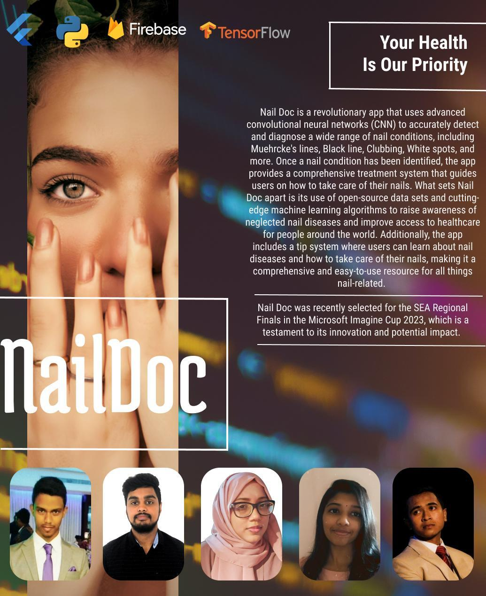

# NailDoc

**NailDoc** is a mobile application that leverages deep learning to classify nail conditions from images.
The app is designed to make early detection of nail health issues more accessible by allowing users to upload or capture images and receive instant predictions.

---
## Project Cover

## Project Overview

* **Frontend**: Built with **Flutter**, providing a smooth mobile experience. Users can either capture nail images via the device camera or upload from the gallery.
* **Backend**: Powered by a deep learning model trained with **TensorFlow/Keras** and hosted on **Google Cloud Platform (GCP)** for scalable and responsive inference.
* **Model**:

  * Base architecture: **EfficientNetB3** pre-trained on ImageNet.
  * Custom classification head with Dense + Dropout layers.
  * Loss: *categorical cross-entropy*, Optimizer: *Adamax*.
  * Training pipeline includes:

    * Dataset preprocessing and stratified train/validation/test split.
    * Balancing classes via augmentation (Keras `ImageDataGenerator`).
    * Callbacks for learning rate scheduling and early stopping.
* **Outputs**:

  * Predicted class of nail condition.
  * Confusion matrix & training history plots for model evaluation.
  * Saved model weights (`.h5`) and class dictionary (`.csv`) for deployment.

---

## Features

* Real-time inference on uploaded/captured images.
* Robust data preprocessing with balanced class distribution.
* Visualization tools: training accuracy/loss curves, confusion matrix.
* Cloud-deployed model for seamless integration with the Flutter app.

---

##  Tech Stack

* **Frontend**: Flutter (Dart)
* **Backend**: Python, TensorFlow, Keras, scikit-learn, Pandas, NumPy
* **Deployment**: Google Cloud Platform (GCP)
* **Visualization & Utilities**: Matplotlib, Seaborn

---

## Example Workflow

1. User uploads/captures an image from the NailDoc app.
2. Image is sent to the backend hosted on GCP.
3. The deep learning model processes the input and predicts the nail condition.
4. Results are returned to the app and displayed to the user.

---

## License

This project is for educational and research purposes.
